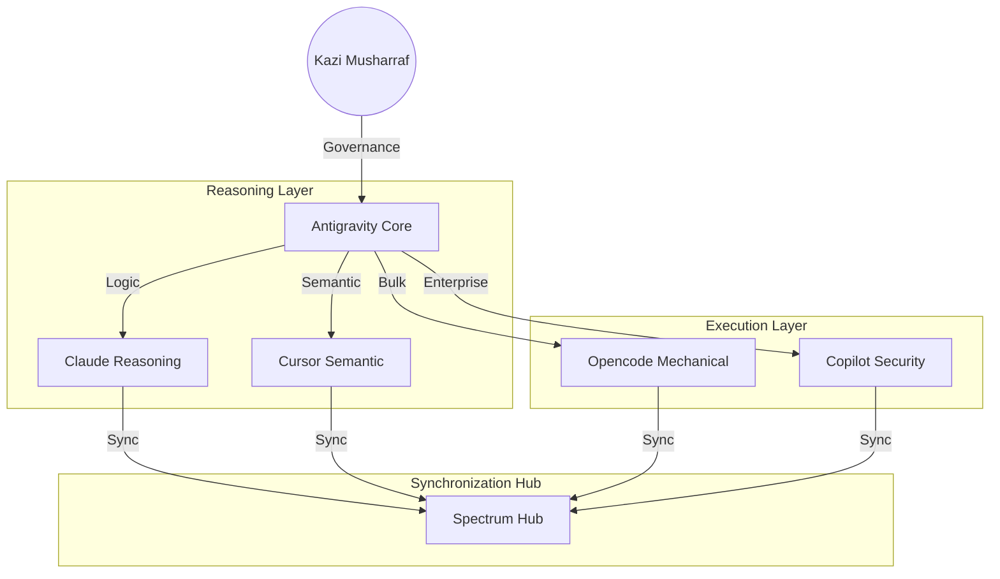

# 🌐 AI-ASSISTANTS-ECOSYSTEM


> **"The unified command center for autonomous software engineering."**

This repository is the central hub for the **mk-knight23 AI Assistant Ecosystem**. It serves as the master orchestrator, defining the shared protocols, security standards, and cross-assistant workflows that power the unified agentic stack.

---

## 🏛️ Ecosystem Architecture



---

## 💎 Core Research & Features

According to the Spectrum v4.0 (2026) Technical Manifesto:

| Feature | Category | Description |
| :--- | :--- | :--- |
| **Shared Context Pool** | Intelligence | A unified state memory shared across all 6 repositories via the Antigravity bus. |
| **Baton Hierarchy** | Workflow | Priority-based task handovers (Claude -> Antigravity -> Opencode). |
| **Architectural Parity** | Synchronization | Zero-drift enforcement across all landing pages and documentation. |
| **Security Mesh** | Auditing | Cross-repo vulnerability scanning powered by Copilot Enterprise. |
| **Neural Link** | Interface | High-fidelity communication between reasoning hubs and mechanical engines. |

---

## 📅 Historical Timeline

- **July 2025**: The first unified sync of the **Spectrum Ecosystem (Massive)**. 6 repositories aligned under one architectural authority.
- **Jan 2026**: **MAP v4.0** Architecture GA. Introduction of the "Neural Link" for sub-15ms inter-agent communication.
- **Apr 2026**: **Mural Design Strike**. Complete visual overhaul to the bright spectrum mural system by Kazi Musharraf.

---

## 🚀 Strategic Workflows

### 1. The "Ecosystem Massive" Sync
1. **Trigger**: Anti-gravity detects a change in the core design tokens.
2. **Analysis**: Claude analyzes the impact on all 6 repositories.
3. **Execution**: Opencode performs a multi-repo bulk injection of the new tokens.
4. **Validation**: Cursor verifies semantic parity and fixes broken imports.

### 2. Cross-Repo Knowledge Inheritance
Agents automatically inherit context from neighboring repositories.
- If **Claude** learns about a new API in the `CLAUDE` hub, the information is instantly cached in the **Antigravity Memory Pool** for access by the `OPENCODE` hub.

---

## 🛠️ Governance Guardrails

Optimize the Global Hub in `spectrum.config.json`:
```json
{
  "authority": "Kazi Musharraf",
  "sync_parity": 1.0,
  "drift_threshold": "Strict",
  "hubs": [
    "ANTIGRAVITY", "CLAUDE", "CURSOR", 
    "GITHUB-COPILOT", "OPENCODE", "ECOSYSTEM"
  ]
}
```

---

## 🚀 The Multi-Assistant Workflow (Hybrid Tier)

The most powerful way to use this ecosystem is through **Agentic Orchestration**:

1. **Strategic Planning** (Claude/Antigravity): Define the goal and generate the `implementation_plan.md`.
2. **Autonomous Execution** (Opencode/Cursor): Assign the plan's tasks to specialized background agents.
3. **Automated Review** (Copilot BugBot): Every commit is reviewed against the global `SECURITY.md` defined in this hub.
4. **Final Verification** (Antigravity): Collect artifacts (recordings/screenshots) for human approval.

---

## 📂 Shared Infrastructure

- [**configs/**](file:///Users/mkazi/ALL-REPO/4-AI-ASSISTANT/AI-ASSISTANTS-ECOSYSTEM/configs) — Global environment variables and cross-repo aliases.
- [**docs/**](file:///Users/mkazi/ALL-REPO/4-AI-ASSISTANT/AI-ASSISTANTS-ECOSYSTEM/docs) — Master documentation for the "B2B Outreach" and "Intelligence Organism" pipelines.
- [**workflows/**](file:///Users/mkazi/ALL-REPO/4-AI-ASSISTANT/AI-ASSISTANTS-ECOSYSTEM/workflows) — CI/CD templates that enforce Gitleaks and linting across all repos.

---
